# LLM Selector Workflow Diagrams

Comprehensive workflow diagrams explaining the llm-selector library's architecture, selection strategies, and failure handling mechanisms.

## Table of Contents

- [High-Level Architecture](#high-level-architecture)
- [Random Selection Workflow](#random-selection-workflow)
- [Round-Robin Selection Workflow](#round-robin-selection-workflow)
- [Detailed Round-Robin Algorithm](#detailed-round-robin-algorithm)
- [State Management](#state-management)

---

## High-Level Architecture

The llm-selector library consists of three main components that work together to provide intelligent provider selection with automatic retry and cooldown tracking.

The following flowcharts show the core logic flows with decision points, process steps, and control flow.

### 1. suggest_provider() Flow

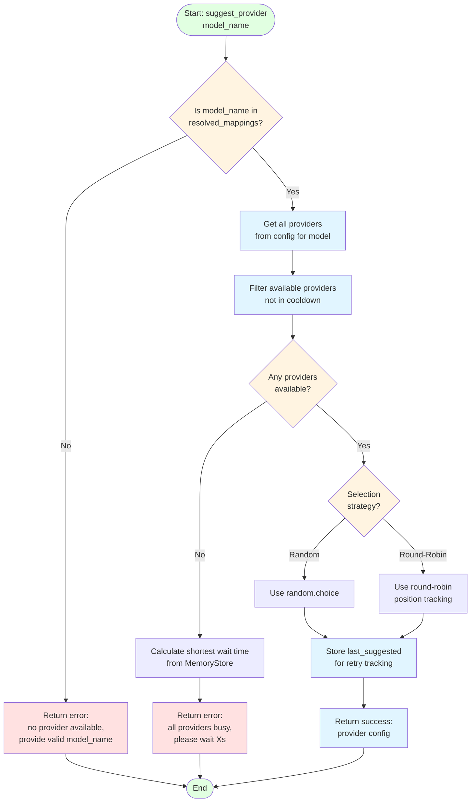
```mermaid
flowchart TD
    Start([Start: suggest_provider<br/>model_name])
    ValidateModel{Is model_name in<br/>resolved_mappings?}
    ErrorInvalid[Return error:<br/>no provider available,<br/>provide valid model_name]
    GetProviders[Get all providers<br/>from config for model]
    FilterAvailable[Filter available providers<br/>not in cooldown]
    CheckAvailable{Any providers<br/>available?}
    CalcWait[Calculate shortest wait time<br/>from MemoryStore]
    ErrorBusy[Return error:<br/>all providers busy,<br/>please wait Xs]
    SelectStrategy{Selection<br/>strategy?}
    RandomSelect[Use random.choice]
    RoundRobinSelect[Use round-robin<br/>position tracking]
    StoreSelection[Store last_suggested<br/>for retry tracking]
    ReturnSuccess[Return success:<br/>provider config]
    End([End])

    Start --> ValidateModel
    ValidateModel -->|No| ErrorInvalid
    ValidateModel -->|Yes| GetProviders
    GetProviders --> FilterAvailable
    FilterAvailable --> CheckAvailable
    CheckAvailable -->|No| CalcWait
    CalcWait --> ErrorBusy
    CheckAvailable -->|Yes| SelectStrategy
    SelectStrategy -->|Random| RandomSelect
    SelectStrategy -->|Round-Robin| RoundRobinSelect
    RandomSelect --> StoreSelection
    RoundRobinSelect --> StoreSelection
    StoreSelection --> ReturnSuccess
    ReturnSuccess --> End
    ErrorInvalid --> End
    ErrorBusy --> End

    style Start fill:#e1ffe1
    style End fill:#e1ffe1
    style ValidateModel fill:#fff4e1
    style CheckAvailable fill:#fff4e1
    style SelectStrategy fill:#fff4e1
    style ErrorInvalid fill:#ffe1e1
    style ErrorBusy fill:#ffe1e1
    style GetProviders fill:#e1f5ff
    style FilterAvailable fill:#e1f5ff
    style StoreSelection fill:#e1f5ff
    style ReturnSuccess fill:#e1f5ff
```

### 2. retry_suggestion() Flow

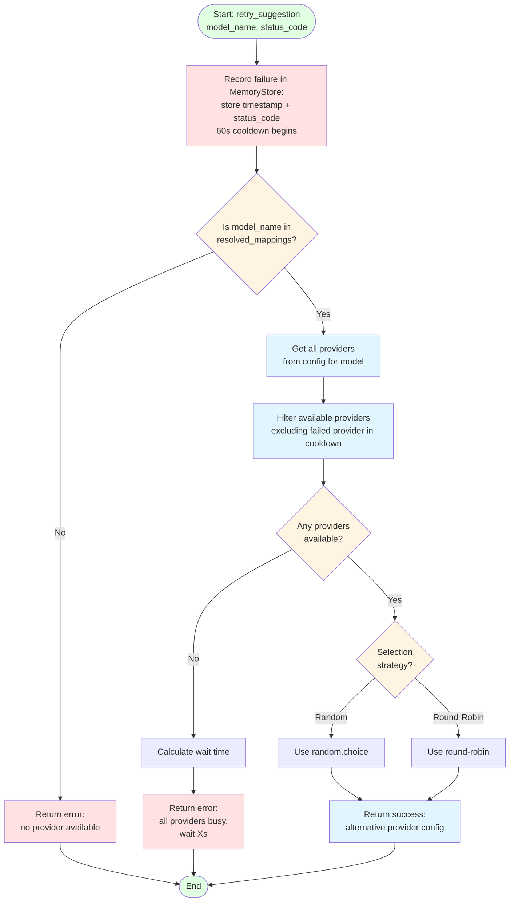
```mermaid
flowchart TD
    Start([Start: retry_suggestion<br/>model_name, status_code])
    RecordFailure[Record failure in MemoryStore:<br/>store timestamp + status_code<br/>60s cooldown begins]
    ValidateModel{Is model_name in<br/>resolved_mappings?}
    ErrorInvalid[Return error:<br/>no provider available]
    GetProviders[Get all providers<br/>from config for model]
    FilterAvailable[Filter available providers<br/>excluding failed provider in cooldown]
    CheckAvailable{Any providers<br/>available?}
    CalcWait[Calculate wait time]
    ErrorBusy[Return error:<br/>all providers busy,<br/>wait Xs]
    SelectStrategy{Selection<br/>strategy?}
    RandomSelect[Use random.choice]
    RoundRobinSelect[Use round-robin]
    ReturnSuccess[Return success:<br/>alternative provider config]
    End([End])

    Start --> RecordFailure
    RecordFailure --> ValidateModel
    ValidateModel -->|No| ErrorInvalid
    ValidateModel -->|Yes| GetProviders
    GetProviders --> FilterAvailable
    FilterAvailable --> CheckAvailable
    CheckAvailable -->|No| CalcWait
    CalcWait --> ErrorBusy
    CheckAvailable -->|Yes| SelectStrategy
    SelectStrategy -->|Random| RandomSelect
    SelectStrategy -->|Round-Robin| RoundRobinSelect
    RandomSelect --> ReturnSuccess
    RoundRobinSelect --> ReturnSuccess
    ReturnSuccess --> End
    ErrorInvalid --> End
    ErrorBusy --> End

    style Start fill:#e1ffe1
    style End fill:#e1ffe1
    style RecordFailure fill:#ffe1e1
    style ValidateModel fill:#fff4e1
    style CheckAvailable fill:#fff4e1
    style SelectStrategy fill:#fff4e1
    style ErrorInvalid fill:#ffe1e1
    style ErrorBusy fill:#ffe1e1
    style GetProviders fill:#e1f5ff
    style FilterAvailable fill:#e1f5ff
    style ReturnSuccess fill:#e1f5ff
```

### 3. Provider Selection Strategy (_select_provider)

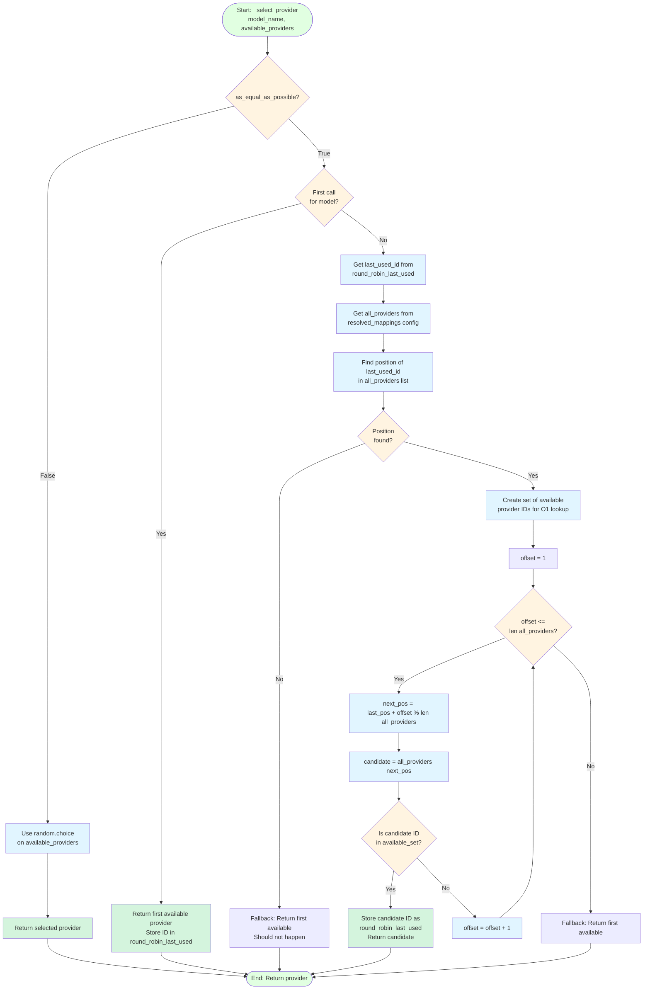
```mermaid
flowchart TD
    Start([Start: _select_provider<br/>model_name, available_providers])
    CheckStrategy{as_equal_as_possible?}
    RandomPath[Use random.choice<br/>on available_providers]
    ReturnRandom[Return selected provider]
    CheckFirstTime{First call<br/>for model?}
    FirstTime[Return first available provider<br/>Store ID in round_robin_last_used]
    GetLastUsed[Get last_used_id from<br/>round_robin_last_used]
    GetFullList[Get all_providers from<br/>resolved_mappings config]
    FindPosition[Find position of last_used_id<br/>in all_providers list]
    PositionFound{Position<br/>found?}
    FallbackFirst[Fallback: Return first available<br/>Should not happen]
    CreateAvailableSet[Create set of available<br/>provider IDs for O1 lookup]
    StartLoop[offset = 1]
    LoopCondition{offset <=<br/>len all_providers?}
    CalcPosition[next_pos = <br/>last_pos + offset % len all_providers]
    GetCandidate[candidate = all_providers next_pos]
    CheckAvailable{Is candidate ID<br/>in available_set?}
    StoreAndReturn[Store candidate ID as<br/>round_robin_last_used<br/>Return candidate]
    IncrementOffset[offset = offset + 1]
    FallbackEnd[Fallback: Return first available]
    End([End: Return provider])

    Start --> CheckStrategy
    CheckStrategy -->|False| RandomPath
    RandomPath --> ReturnRandom
    ReturnRandom --> End
    CheckStrategy -->|True| CheckFirstTime
    CheckFirstTime -->|Yes| FirstTime
    FirstTime --> End
    CheckFirstTime -->|No| GetLastUsed
    GetLastUsed --> GetFullList
    GetFullList --> FindPosition
    FindPosition --> PositionFound
    PositionFound -->|No| FallbackFirst
    FallbackFirst --> End
    PositionFound -->|Yes| CreateAvailableSet
    CreateAvailableSet --> StartLoop
    StartLoop --> LoopCondition
    LoopCondition -->|Yes| CalcPosition
    CalcPosition --> GetCandidate
    GetCandidate --> CheckAvailable
    CheckAvailable -->|Yes| StoreAndReturn
    StoreAndReturn --> End
    CheckAvailable -->|No| IncrementOffset
    IncrementOffset --> LoopCondition
    LoopCondition -->|No| FallbackEnd
    FallbackEnd --> End

    style Start fill:#e1ffe1
    style End fill:#e1ffe1
    style CheckStrategy fill:#fff4e1
    style CheckFirstTime fill:#fff4e1
    style PositionFound fill:#fff4e1
    style LoopCondition fill:#fff4e1
    style CheckAvailable fill:#fff4e1
    style RandomPath fill:#e1f5ff
    style GetLastUsed fill:#e1f5ff
    style GetFullList fill:#e1f5ff
    style FindPosition fill:#e1f5ff
    style CreateAvailableSet fill:#e1f5ff
    style CalcPosition fill:#e1f5ff
    style GetCandidate fill:#e1f5ff
    style IncrementOffset fill:#e1f5ff
    style StoreAndReturn fill:#d4f4dd
    style ReturnRandom fill:#d4f4dd
    style FirstTime fill:#d4f4dd
```

### 4. Cooldown Check Logic (MemoryStore.is_available)

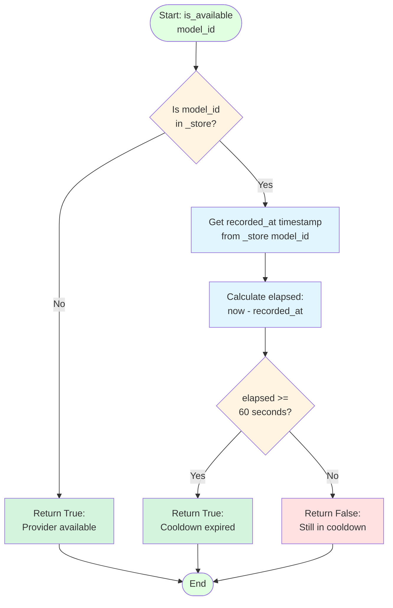
```mermaid
flowchart TD
    Start([Start: is_available<br/>model_id])
    CheckStore{Is model_id<br/>in _store?}
    ReturnAvailable1[Return True:<br/>Provider available]
    GetTimestamp[Get recorded_at timestamp<br/>from _store model_id]
    CalcElapsed[Calculate elapsed:<br/>now - recorded_at]
    CheckCooldown{elapsed >=<br/>60 seconds?}
    ReturnAvailable2[Return True:<br/>Cooldown expired]
    ReturnUnavailable[Return False:<br/>Still in cooldown]
    End([End])

    Start --> CheckStore
    CheckStore -->|No| ReturnAvailable1
    CheckStore -->|Yes| GetTimestamp
    GetTimestamp --> CalcElapsed
    CalcElapsed --> CheckCooldown
    CheckCooldown -->|Yes| ReturnAvailable2
    CheckCooldown -->|No| ReturnUnavailable
    ReturnAvailable1 --> End
    ReturnAvailable2 --> End
    ReturnUnavailable --> End

    style Start fill:#e1ffe1
    style End fill:#e1ffe1
    style CheckStore fill:#fff4e1
    style CheckCooldown fill:#fff4e1
    style GetTimestamp fill:#e1f5ff
    style CalcElapsed fill:#e1f5ff
    style ReturnAvailable1 fill:#d4f4dd
    style ReturnAvailable2 fill:#d4f4dd
    style ReturnUnavailable fill:#ffe1e1
```

### Component Responsibilities

**LLMSelector** (`selector.py`)
- Main entry point for provider selection
- Manages selection strategies (random vs round-robin)
- Tracks last suggested provider per model
- Maintains round-robin state (last used provider ID)

**MemoryStore** (`memory_store.py`)
- Tracks provider failures with timestamps
- Implements 60-second cooldown logic
- Filters available providers based on cooldown status
- Calculates wait times when all providers are busy

**Configuration** (`config.py`)
- MODEL_MAPPINGS: Maps model names to provider lists
- Each provider has: model_id, model, api_base, api_key, etc.
- Example: `gpt-4.1` maps to 4 providers [OpenAI, Azure-AUEast, Azure-NorthCentralUS, Azure-SouthCentralUS]

---

## Random Selection Workflow

Random selection (`as_equal_as_possible=False`) uses `random.choice()` to distribute load across available providers.

### Happy Scenario - All Providers Available

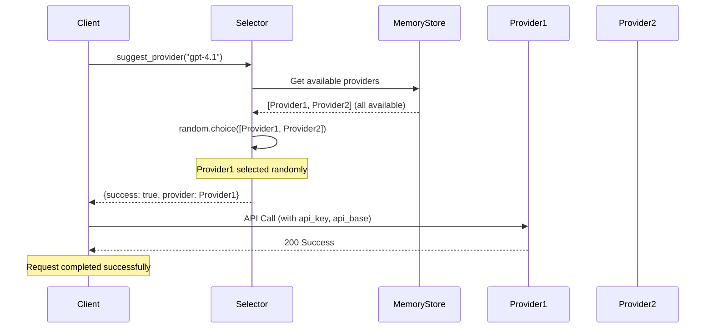
```mermaid
sequenceDiagram
    participant Client
    participant Selector
    participant MemoryStore
    participant Provider1
    participant Provider2

    Client->>Selector: suggest_provider("gpt-4.1")
    Selector->>MemoryStore: Get available providers
    MemoryStore-->>Selector: [Provider1, Provider2] (all available)
    Selector->>Selector: random.choice([Provider1, Provider2])
    Note over Selector: Provider1 selected randomly
    Selector-->>Client: {success: true, provider: Provider1}
    Client->>Provider1: API Call (with api_key, api_base)
    Provider1-->>Client: 200 Success
    Note over Client: Request completed successfully
```

### Unhappy Scenario - Provider Fails, Retry with Alternative

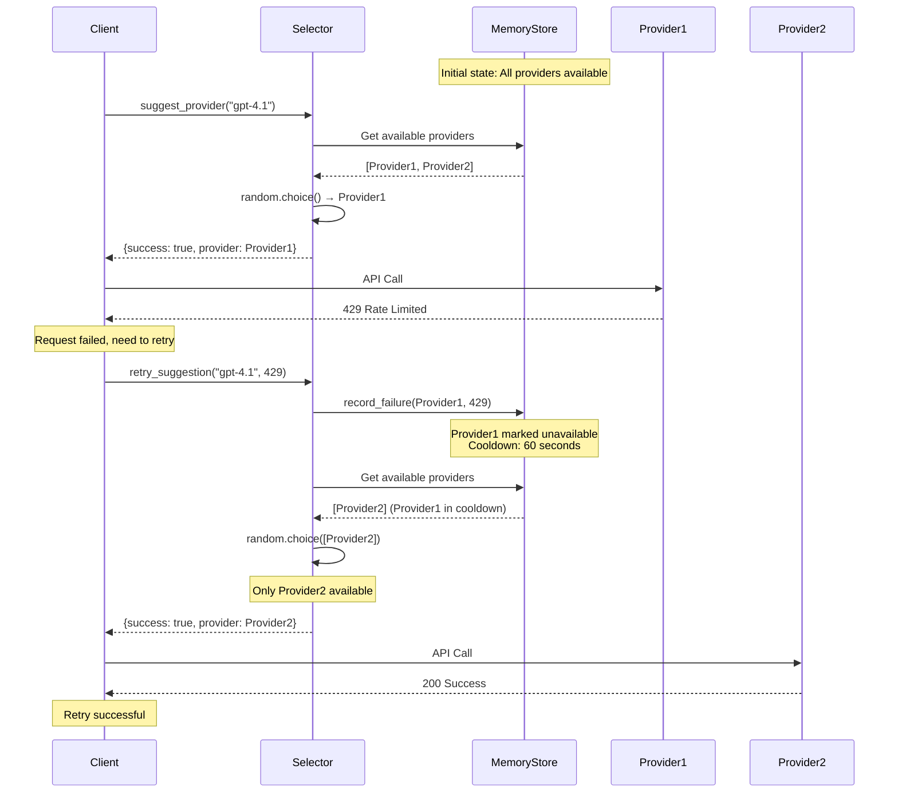
```mermaid
sequenceDiagram
    participant Client
    participant Selector
    participant MemoryStore
    participant Provider1
    participant Provider2

    Note over MemoryStore: Initial state: All providers available

    Client->>Selector: suggest_provider("gpt-4.1")
    Selector->>MemoryStore: Get available providers
    MemoryStore-->>Selector: [Provider1, Provider2]
    Selector->>Selector: random.choice() → Provider1
    Selector-->>Client: {success: true, provider: Provider1}

    Client->>Provider1: API Call
    Provider1-->>Client: 429 Rate Limited
    Note over Client: Request failed, need to retry

    Client->>Selector: retry_suggestion("gpt-4.1", 429)
    Selector->>MemoryStore: record_failure(Provider1, 429)
    Note over MemoryStore: Provider1 marked unavailable<br/>Cooldown: 60 seconds

    Selector->>MemoryStore: Get available providers
    MemoryStore-->>Selector: [Provider2] (Provider1 in cooldown)
    Selector->>Selector: random.choice([Provider2])
    Note over Selector: Only Provider2 available
    Selector-->>Client: {success: true, provider: Provider2}

    Client->>Provider2: API Call
    Provider2-->>Client: 200 Success
    Note over Client: Retry successful
```

### Worst Case - All Providers Busy

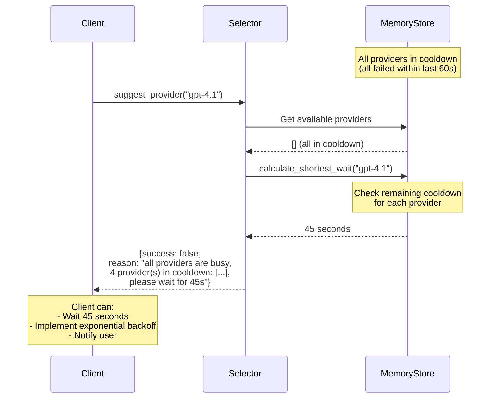
```mermaid
sequenceDiagram
    participant Client
    participant Selector
    participant MemoryStore

    Note over MemoryStore: All providers in cooldown<br/>(all failed within last 60s)

    Client->>Selector: suggest_provider("gpt-4.1")
    Selector->>MemoryStore: Get available providers
    MemoryStore-->>Selector: [] (all in cooldown)

    Selector->>MemoryStore: calculate_shortest_wait("gpt-4.1")
    Note over MemoryStore: Check remaining cooldown<br/>for each provider
    MemoryStore-->>Selector: 45 seconds

    Selector-->>Client: {success: false,<br/>reason: "all providers are busy,<br/>4 provider(s) in cooldown: [...],<br/>please wait for 45s"}

    Note over Client: Client can:<br/>- Wait 45 seconds<br/>- Implement exponential backoff<br/>- Notify user
```

---

## Round-Robin Selection Workflow

Round-robin selection (`as_equal_as_possible=True`) ensures equal distribution by maintaining sequence based on provider configuration order.

### Key Characteristics

- Tracks last used provider ID (not index)
- Maintains sequence based on configuration order
- Finds next provider in full list, cycles through to find available
- Never skips providers in the sequence
- Handles providers going in/out of cooldown gracefully

### Happy Scenario - Sequential Provider Usage

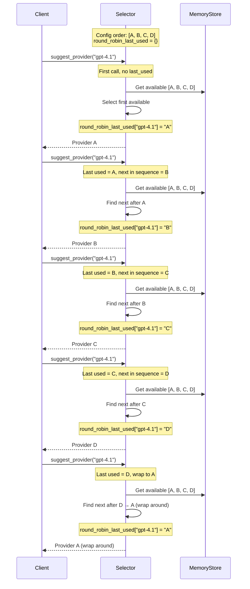
```mermaid
sequenceDiagram
    participant Client
    participant Selector
    participant MemoryStore

    Note over Selector: Config order: [A, B, C, D]<br/>round_robin_last_used = {}

    Client->>Selector: suggest_provider("gpt-4.1")
    Note over Selector: First call, no last_used
    Selector->>MemoryStore: Get available [A, B, C, D]
    Selector->>Selector: Select first available
    Note over Selector: round_robin_last_used["gpt-4.1"] = "A"
    Selector-->>Client: Provider A

    Client->>Selector: suggest_provider("gpt-4.1")
    Note over Selector: Last used = A, next in sequence = B
    Selector->>MemoryStore: Get available [A, B, C, D]
    Selector->>Selector: Find next after A
    Note over Selector: round_robin_last_used["gpt-4.1"] = "B"
    Selector-->>Client: Provider B

    Client->>Selector: suggest_provider("gpt-4.1")
    Note over Selector: Last used = B, next in sequence = C
    Selector->>MemoryStore: Get available [A, B, C, D]
    Selector->>Selector: Find next after B
    Note over Selector: round_robin_last_used["gpt-4.1"] = "C"
    Selector-->>Client: Provider C

    Client->>Selector: suggest_provider("gpt-4.1")
    Note over Selector: Last used = C, next in sequence = D
    Selector->>MemoryStore: Get available [A, B, C, D]
    Selector->>Selector: Find next after C
    Note over Selector: round_robin_last_used["gpt-4.1"] = "D"
    Selector-->>Client: Provider D

    Client->>Selector: suggest_provider("gpt-4.1")
    Note over Selector: Last used = D, wrap to A
    Selector->>MemoryStore: Get available [A, B, C, D]
    Selector->>Selector: Find next after D → A (wrap around)
    Note over Selector: round_robin_last_used["gpt-4.1"] = "A"
    Selector-->>Client: Provider A (wrap around)
```

### Unhappy Scenario - Provider Fails, Sequence Continues

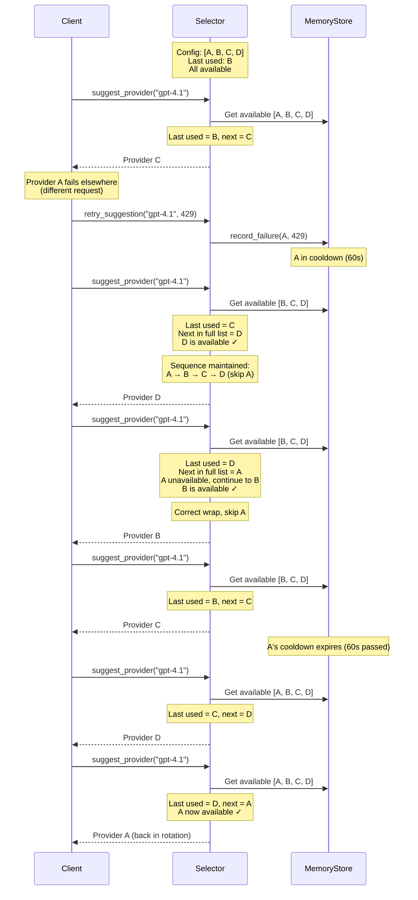
```mermaid
sequenceDiagram
    participant Client
    participant Selector
    participant MemoryStore

    Note over Selector: Config: [A, B, C, D]<br/>Last used: B<br/>All available

    Client->>Selector: suggest_provider("gpt-4.1")
    Selector->>MemoryStore: Get available [A, B, C, D]
    Note over Selector: Last used = B, next = C
    Selector-->>Client: Provider C

    Note over Client: Provider A fails elsewhere<br/>(different request)
    Client->>Selector: retry_suggestion("gpt-4.1", 429)
    Selector->>MemoryStore: record_failure(A, 429)
    Note over MemoryStore: A in cooldown (60s)

    Client->>Selector: suggest_provider("gpt-4.1")
    Selector->>MemoryStore: Get available [B, C, D]
    Note over Selector: Last used = C<br/>Next in full list = D<br/>D is available ✓
    Note over Selector: Sequence maintained:<br/>A → B → C → D (skip A)
    Selector-->>Client: Provider D

    Client->>Selector: suggest_provider("gpt-4.1")
    Selector->>MemoryStore: Get available [B, C, D]
    Note over Selector: Last used = D<br/>Next in full list = A<br/>A unavailable, continue to B<br/>B is available ✓
    Note over Selector: Correct wrap, skip A
    Selector-->>Client: Provider B

    Client->>Selector: suggest_provider("gpt-4.1")
    Selector->>MemoryStore: Get available [B, C, D]
    Note over Selector: Last used = B, next = C
    Selector-->>Client: Provider C

    Note over MemoryStore: A's cooldown expires (60s passed)

    Client->>Selector: suggest_provider("gpt-4.1")
    Selector->>MemoryStore: Get available [A, B, C, D]
    Note over Selector: Last used = C, next = D
    Selector-->>Client: Provider D

    Client->>Selector: suggest_provider("gpt-4.1")
    Selector->>MemoryStore: Get available [A, B, C, D]
    Note over Selector: Last used = D, next = A<br/>A now available ✓
    Selector-->>Client: Provider A (back in rotation)
```

### Complex Scenario - Multiple Providers Fail and Recover

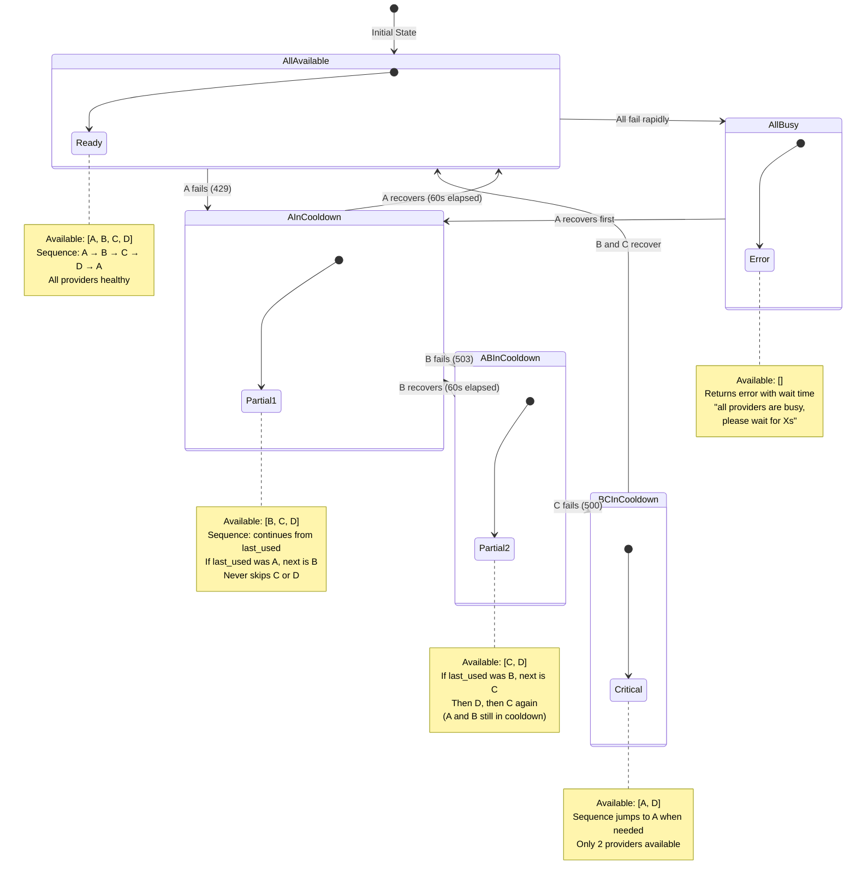
```mermaid
stateDiagram-v2
    [*] --> AllAvailable: Initial State

    state AllAvailable {
        [*] --> Ready
        note right of Ready
            Available: [A, B, C, D]
            Sequence: A → B → C → D → A
            All providers healthy
        end note
    }

    AllAvailable --> AInCooldown: A fails (429)

    state AInCooldown {
        [*] --> Partial1
        note right of Partial1
            Available: [B, C, D]
            Sequence: continues from last_used
            If last_used was A, next is B
            Never skips C or D
        end note
    }

    AInCooldown --> ABInCooldown: B fails (503)

    state ABInCooldown {
        [*] --> Partial2
        note right of Partial2
            Available: [C, D]
            If last_used was B, next is C
            Then D, then C again
            (A and B still in cooldown)
        end note
    }

    ABInCooldown --> AInCooldown: B recovers (60s elapsed)
    AInCooldown --> AllAvailable: A recovers (60s elapsed)

    ABInCooldown --> BCInCooldown: C fails (500)

    state BCInCooldown {
        [*] --> Critical
        note right of Critical
            Available: [A, D]
            Sequence jumps to A when needed
            Only 2 providers available
        end note
    }

    BCInCooldown --> AllAvailable: B and C recover

    AllAvailable --> AllBusy: All fail rapidly

    state AllBusy {
        [*] --> Error
        note right of Error
            Available: []
            Returns error with wait time
            "all providers are busy,
            please wait for Xs"
        end note
    }

    AllBusy --> AInCooldown: A recovers first
```

### Round-Robin with Concurrent Failures

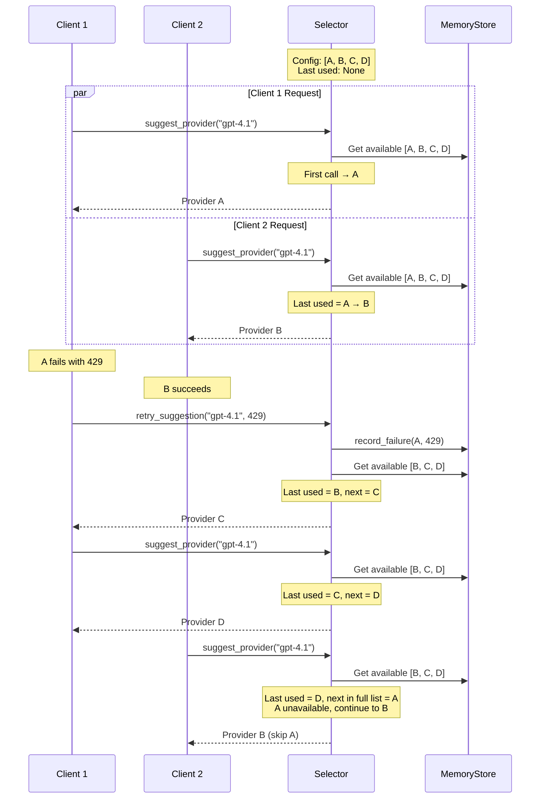
```mermaid
sequenceDiagram
    participant Client1 as Client 1
    participant Client2 as Client 2
    participant Selector
    participant MemoryStore

    Note over Selector: Config: [A, B, C, D]<br/>Last used: None

    par Client 1 Request
        Client1->>Selector: suggest_provider("gpt-4.1")
        Selector->>MemoryStore: Get available [A, B, C, D]
        Note over Selector: First call → A
        Selector-->>Client1: Provider A
    and Client 2 Request
        Client2->>Selector: suggest_provider("gpt-4.1")
        Selector->>MemoryStore: Get available [A, B, C, D]
        Note over Selector: Last used = A → B
        Selector-->>Client2: Provider B
    end

    Note over Client1: A fails with 429
    Note over Client2: B succeeds

    Client1->>Selector: retry_suggestion("gpt-4.1", 429)
    Selector->>MemoryStore: record_failure(A, 429)
    Selector->>MemoryStore: Get available [B, C, D]
    Note over Selector: Last used = B, next = C
    Selector-->>Client1: Provider C

    Client1->>Selector: suggest_provider("gpt-4.1")
    Selector->>MemoryStore: Get available [B, C, D]
    Note over Selector: Last used = C, next = D
    Selector-->>Client1: Provider D

    Client2->>Selector: suggest_provider("gpt-4.1")
    Selector->>MemoryStore: Get available [B, C, D]
    Note over Selector: Last used = D, next in full list = A<br/>A unavailable, continue to B
    Selector-->>Client2: Provider B (skip A)
```

---

## Detailed Round-Robin Algorithm

Step-by-step flowchart of the `_select_provider()` method when `as_equal_as_possible=True`.

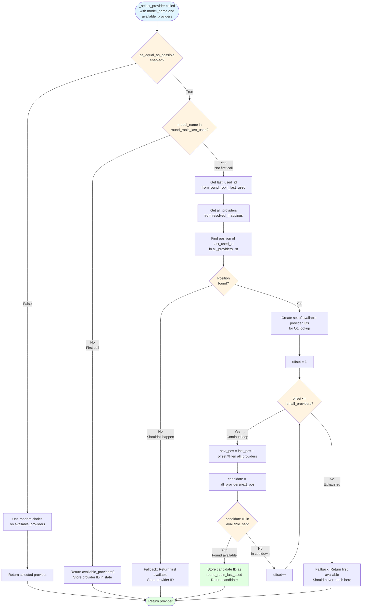
```mermaid
flowchart TD
    Start([_select_provider called<br/>with model_name and<br/>available_providers])

    CheckStrategy{as_equal_as_possible<br/>enabled?}

    RandomPath[Use random.choice<br/>on available_providers]
    ReturnRandom[Return selected provider]

    CheckFirstTime{model_name in<br/>round_robin_last_used?}
    FirstTime[Return available_providers0<br/>Store provider ID in state]

    GetLastUsed[Get last_used_id<br/>from round_robin_last_used]
    GetFullList[Get all_providers<br/>from resolved_mappings]
    FindPosition[Find position of last_used_id<br/>in all_providers list]

    PositionFound{Position<br/>found?}
    FallbackFirst[Fallback: Return first available<br/>Store provider ID]

    CreateAvailableSet[Create set of available provider IDs<br/>for O1 lookup]
    StartLoop[offset = 1]
    LoopCondition{offset <=<br/>len all_providers?}

    CalcPosition[next_pos = last_pos + offset % len all_providers]
    GetCandidate[candidate = all_providersnext_pos]
    CheckAvailable{candidate ID in<br/>available_set?}

    StoreAndReturn[Store candidate ID as<br/>round_robin_last_used<br/>Return candidate]
    IncrementOffset[offset++]
    FallbackEnd[Fallback: Return first available<br/>Should never reach here]

    End([Return provider])

    Start --> CheckStrategy

    CheckStrategy -->|False| RandomPath
    RandomPath --> ReturnRandom
    ReturnRandom --> End

    CheckStrategy -->|True| CheckFirstTime
    CheckFirstTime -->|No<br/>First call| FirstTime
    FirstTime --> End

    CheckFirstTime -->|Yes<br/>Not first call| GetLastUsed
    GetLastUsed --> GetFullList
    GetFullList --> FindPosition
    FindPosition --> PositionFound

    PositionFound -->|No<br/>Shouldn't happen| FallbackFirst
    FallbackFirst --> End

    PositionFound -->|Yes| CreateAvailableSet
    CreateAvailableSet --> StartLoop
    StartLoop --> LoopCondition

    LoopCondition -->|Yes<br/>Continue loop| CalcPosition
    CalcPosition --> GetCandidate
    GetCandidate --> CheckAvailable

    CheckAvailable -->|Yes<br/>Found available| StoreAndReturn
    StoreAndReturn --> End

    CheckAvailable -->|No<br/>In cooldown| IncrementOffset
    IncrementOffset --> LoopCondition

    LoopCondition -->|No<br/>Exhausted| FallbackEnd
    FallbackEnd --> End

    style Start fill:#e1f5ff
    style End fill:#e1ffe1
    style CheckStrategy fill:#fff4e1
    style CheckFirstTime fill:#fff4e1
    style PositionFound fill:#fff4e1
    style LoopCondition fill:#fff4e1
    style CheckAvailable fill:#fff4e1
    style StoreAndReturn fill:#e1ffe1
```

### Algorithm Explanation

1. **Strategy Check**: First determines if round-robin is enabled
   - If `False`: Use simple `random.choice()` and return
   - If `True`: Continue with round-robin logic

2. **First Call Check**: Check if this is the first selection for this model
   - If yes: Return first available provider and store its ID
   - If no: Continue with position-based selection

3. **Position Finding**: Locate the last used provider in the full provider list
   - Uses provider ID (not index) for tracking
   - This maintains correct sequence even when providers go in/out of cooldown

4. **Cyclic Search**: Starting from next position, cycle through full list
   - Calculate next position with wraparound: `(last_pos + offset) % len(all_providers)`
   - Check if candidate provider is in available set (O(1) lookup)
   - Continue until available provider found

5. **State Update**: Store the selected provider's ID for next round

### Example Walkthrough

**Setup:**
- Config: `[A, B, C, D]` (indices 0, 1, 2, 3)
- Last used: Provider C (index 2)
- Available: `[B, D]` (A and C in cooldown)

**Execution:**
1. Find C at position 2 in full list
2. Create available set: `{B, D}`
3. Loop with offset:
   - offset=1: position=3, candidate=D, D in available ✓ → Return D
4. Store D as last_used

**Next Call:**
- Last used: D (index 3)
- Available: `[A, B, D]` (C still in cooldown)
- Loop:
   - offset=1: position=0, candidate=A, A in available ✓ → Return A (wrap around)

---

## State Management

### MemoryStore State Diagram

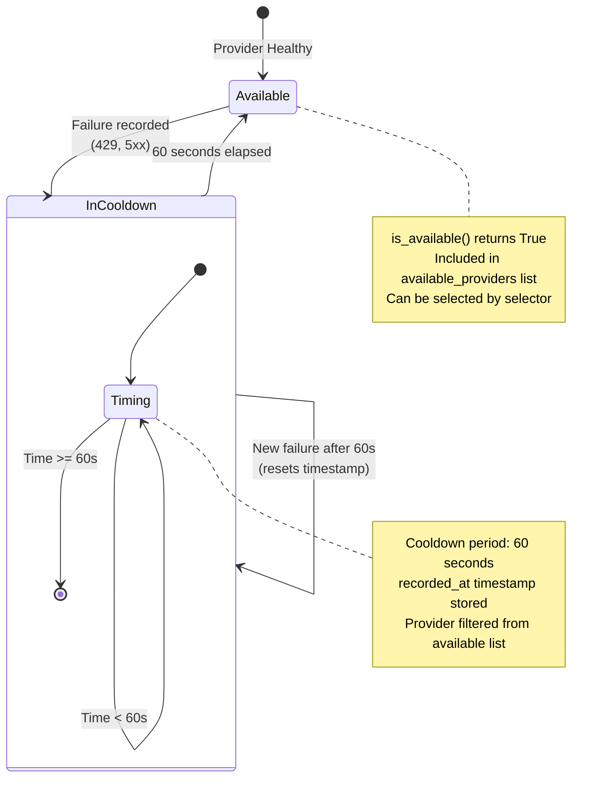
```mermaid
stateDiagram-v2
    [*] --> Available: Provider Healthy

    Available --> InCooldown: Failure recorded<br/>(429, 5xx)

    state InCooldown {
        [*] --> Timing
        Timing --> Timing: Time < 60s
        Timing --> [*]: Time >= 60s
        note right of Timing
            Cooldown period: 60 seconds
            recorded_at timestamp stored
            Provider filtered from available list
        end note
    }

    InCooldown --> Available: 60 seconds elapsed
    InCooldown --> InCooldown: New failure after 60s<br/>(resets timestamp)

    note right of Available
        is_available() returns True
        Included in available_providers list
        Can be selected by selector
    end note
```

### Round-Robin State Tracking

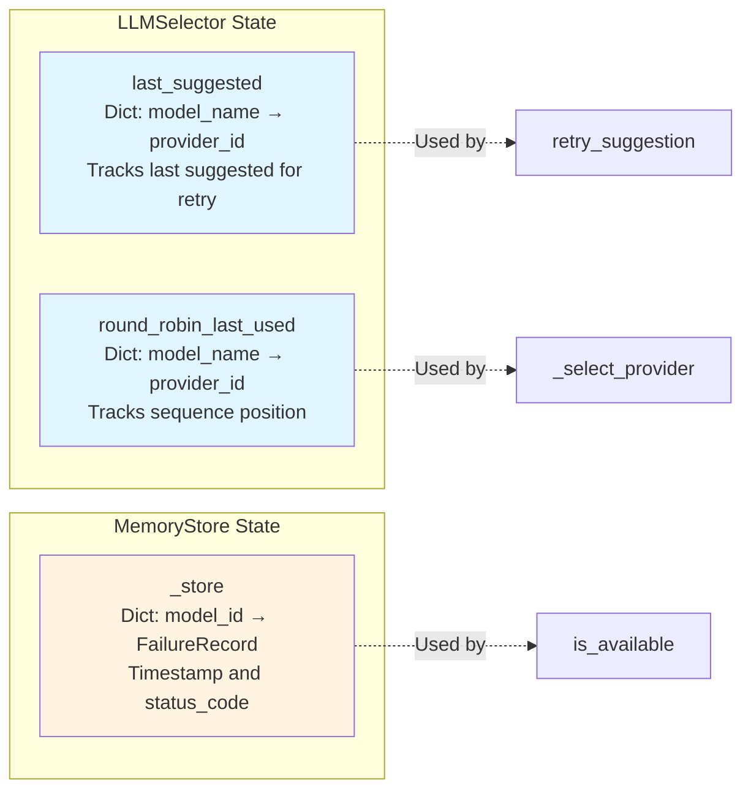
```mermaid
graph LR
    subgraph LLMSelector State
        LastSuggested[last_suggested<br/>Dict: model_name → provider_id<br/>Tracks last suggested for retry]
        RoundRobinState[round_robin_last_used<br/>Dict: model_name → provider_id<br/>Tracks sequence position]
    end

    subgraph MemoryStore State
        FailureRecords[_store<br/>Dict: model_id → FailureRecord<br/>Timestamp and status_code]
    end

    LastSuggested -.->|Used by| RetryLogic[retry_suggestion]
    RoundRobinState -.->|Used by| SelectionLogic[_select_provider]
    FailureRecords -.->|Used by| AvailabilityCheck[is_available]

    style LastSuggested fill:#e1f5ff
    style RoundRobinState fill:#e1f5ff
    style FailureRecords fill:#fff4e1
```

### State Update Flow

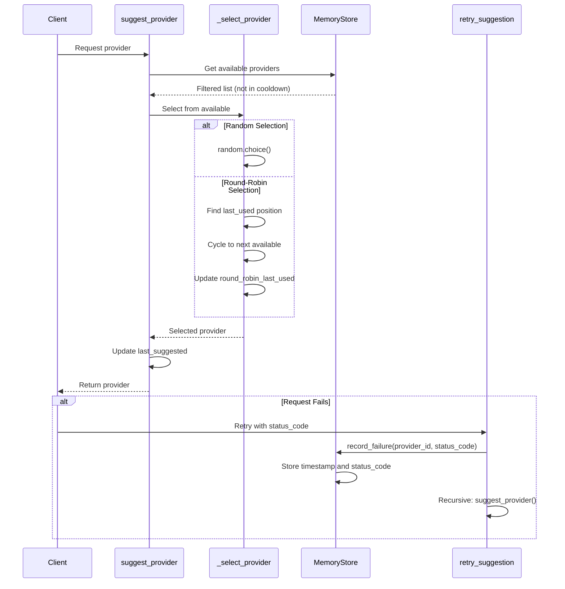
```mermaid
sequenceDiagram
    participant Client
    participant suggest_provider
    participant _select_provider
    participant MemoryStore

    Client->>suggest_provider: Request provider
    suggest_provider->>MemoryStore: Get available providers
    MemoryStore-->>suggest_provider: Filtered list (not in cooldown)

    suggest_provider->>_select_provider: Select from available

    alt Random Selection
        _select_provider->>_select_provider: random.choice()
    else Round-Robin Selection
        _select_provider->>_select_provider: Find last_used position
        _select_provider->>_select_provider: Cycle to next available
        _select_provider->>_select_provider: Update round_robin_last_used
    end

    _select_provider-->>suggest_provider: Selected provider
    suggest_provider->>suggest_provider: Update last_suggested
    suggest_provider-->>Client: Return provider

    alt Request Fails
        Client->>retry_suggestion: Retry with status_code
        retry_suggestion->>MemoryStore: record_failure(provider_id, status_code)
        MemoryStore->>MemoryStore: Store timestamp and status_code
        retry_suggestion->>retry_suggestion: Recursive: suggest_provider()
    end
```

---

## Error Scenarios

### Common HTTP Status Codes

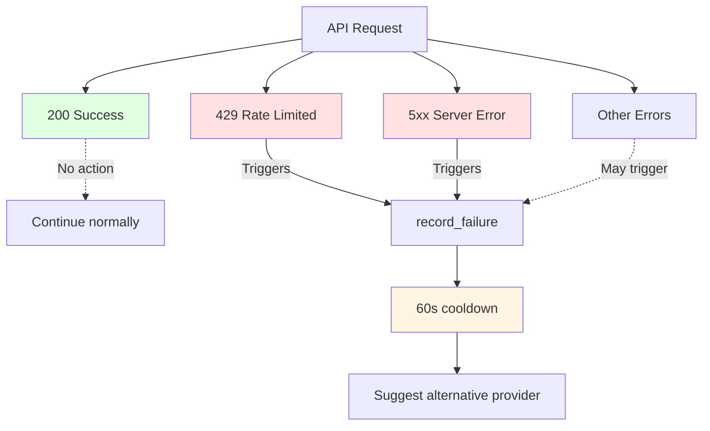
```mermaid
graph TD
    Request[API Request]
    Success[200 Success]
    RateLimit[429 Rate Limited]
    ServerError[5xx Server Error]
    OtherError[Other Errors]

    Request --> Success
    Request --> RateLimit
    Request --> ServerError
    Request --> OtherError

    Success -.->|No action| Continue[Continue normally]

    RateLimit -->|Triggers| RecordFailure[record_failure]
    ServerError -->|Triggers| RecordFailure
    OtherError -.->|May trigger| RecordFailure

    RecordFailure --> Cooldown[60s cooldown]
    Cooldown --> Retry[Suggest alternative provider]

    style Success fill:#e1ffe1
    style RateLimit fill:#ffe1e1
    style ServerError fill:#ffe1e1
    style Cooldown fill:#fff4e1
```

### Error Response Format

**Success Response:**
```json
{
  "success": true,
  "provider": {
    "model_id": "azure-aueast-gpt-4.1",
    "model": "gpt-4.1",
    "api_base": "https://...",
    "api_key": "...",
    "api_version": "2024-02-15-preview"
  }
}
```

**Error Response (Invalid Model):**
```json
{
  "success": false,
  "reason": "no provider available, please provide valid model_name"
}
```

**Error Response (All Busy):**
```json
{
  "success": false,
  "reason": "all providers are busy, 4 provider(s) in cooldown: [openai-gpt-4.1, azure-aueast-gpt-4.1, ...]. please wait for 45s"
}
```

---

## Usage Patterns

### Pattern 1: Simple Retry Loop

```python
selector = LLMSelector(as_equal_as_possible=True)

result = selector.suggest_provider("gpt-4.1")
for attempt in range(3):
    if not result["success"]:
        break

    provider = result["provider"]
    response = make_api_call(provider)

    if response.status_code == 200:
        return response

    result = selector.retry_suggestion("gpt-4.1", response.status_code)
```

### Pattern 2: Exponential Backoff

```python
import time

selector = LLMSelector()

for backoff in [1, 2, 4, 8]:
    result = selector.suggest_provider("gpt-4.1")

    if not result["success"]:
        time.sleep(backoff)
        continue

    response = make_api_call(result["provider"])

    if response.status_code == 200:
        return response

    selector.retry_suggestion("gpt-4.1", response.status_code)
    time.sleep(backoff)
```

### Pattern 3: Concurrent Requests

```python
import asyncio

selector = LLMSelector(as_equal_as_possible=True)

async def make_request(model_name):
    result = selector.suggest_provider(model_name)
    if result["success"]:
        return await async_api_call(result["provider"])

# Multiple concurrent requests will use round-robin
results = await asyncio.gather(
    make_request("gpt-4.1"),
    make_request("gpt-4.1"),
    make_request("gpt-4.1")
)
# Will use providers in sequence: A, B, C
```

---

## Best Practices

1. **Always use retry_suggestion after failures**
   - Records failure in memory store
   - Triggers cooldown period
   - Suggests alternative provider

2. **Handle "all providers busy" errors gracefully**
   - Parse wait time from error message
   - Implement backoff strategy
   - Consider notifying users

3. **Use round-robin for fair distribution**
   - Set `as_equal_as_possible=True`
   - Better load balancing across providers
   - Predictable provider usage

4. **Monitor memory state in long-running processes**
   - Use `get_memory_state()` for debugging
   - Call `reset_memory_store()` periodically
   - Prevents memory leaks

5. **Configure multiple providers per model**
   - Increases availability
   - Reduces impact of single provider failures
   - Better handles rate limits

---

## Appendix: Mermaid Diagram Syntax

All diagrams in this document use [Mermaid](https://mermaid.js.org/) syntax, which is supported by GitHub, GitLab, and many documentation platforms.

To render these diagrams:
- **GitHub/GitLab**: Diagrams render automatically in markdown
- **VS Code**: Install "Markdown Preview Mermaid Support" extension
- **Online**: Use [Mermaid Live Editor](https://mermaid.live/)

To export as images:
- Use Mermaid CLI: `mmdc -i diagram.mmd -o diagram.png`
- Use online editor's export functionality
- Take screenshots from rendered markdown
